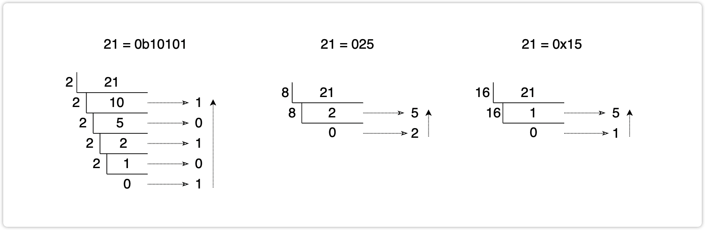
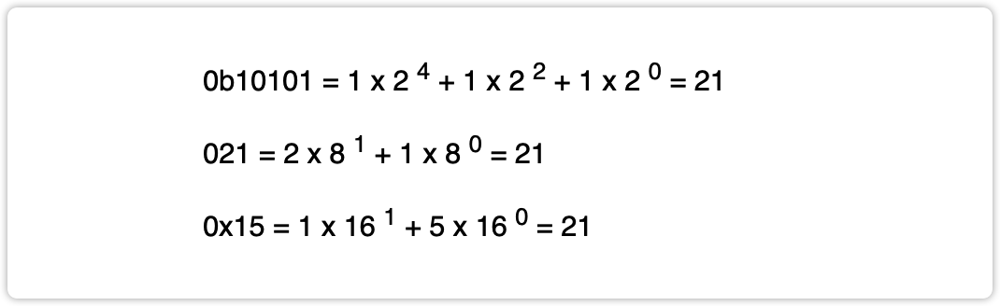
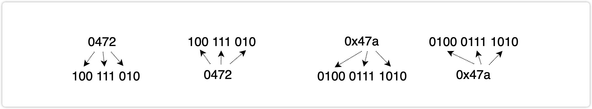

# 一、编程语言是什么

我们编写程序，就是希望与计算机进行交流，让计算机帮助我们实现我们期望的效果。从这点出发，其实和人与人之间的沟通交流是一样的。两个人如果需要正常的沟通交流，必须要满足的条件是，你说的话对方听得懂，对方说的话你也能听得懂。如果条件不满足，你说中文对方不懂，对方说英文你不懂，那么此时就没有办法交流。

写程序也是这样，我们需要和计算机沟通交流。但是很遗憾，机器听不懂我们人类的语言，也学不会人类的语言。那么我们去学习机器的语言呢？更加麻烦，计算机只认识 0 和 1，不会太复杂的语言。此时我们怎么办？

我们可以借助一个 “翻译”，把我们的需求翻译成机器语言，说给机器听。但是，这个翻译其实也是一个程序，依然没有办法学习人类的语言。幸运的是，这个 “翻译员” 有自己的独特的语言体系，而这种语言体系比起机器语言来说，要更加容易理解。这就是我们俗称的 “编程语言”。

编程语言有很多很多，有些语言更加贴合机器的世界，这些语言对我们人类来说，学习的成本就比较高。也有一些语言，更加贴合人类的世界，这类的编程语言，更加符合我们人类的生活习惯和思维逻辑，学习起来难度要小很多，更加容易一些。这样的语言，我们称为 “高级语言”，而 C++ 就是一种高级语言。


# 二、进制

## 1、进制的介绍

在我们正式开始学习 C++ 之前，需要对计算机的一些理论的基础有一定的认知。而进制就是这样的基础，因此我们需要先学习进制。

我们知道在计算机的世界中，只有 0 和 1 两个数字，那么其他的数据该如何去表示呢？

什么是进制？

进制也就是进位计数制，是人为定义的带进位的计数方法（有不带进位的计数方法，比如原始的结绳计数法，唱票时常用的 “正” 字计数法，以及类似的 tally mark 计数）。对于任何一种进制 —— X 进制，就表示每一位置上的数运算时都是逢 X 进一位。十进制是逢十进一，十六进制是逢十六进一，二进制就是逢二进一，以此类推，x 进制就是逢 x 进位。

## 2、进制的分类

**二进制**

用数字 0 和 1 表示每一个自然数，逢 2 进 1。这样的进位制度称为 “二进制”

例如：0, 1, 10, 11, 100, 101, 110, 111, 1000

>   在计算机的世界中，所有的数据最终在存储和运算的时候，都是以二进制的形式进行的。

**十进制**

日常生活中，我们使用到的进位制度。使用数字 0 — 9 表示每一个自然数，逢 10 进 1。这样的进位制度称为 “十进制”。

例如：0, 1, 2, 3, 4, 5, 6, 7, 8, 9, 10, 11, 12, 13, ...

**八进制**

使用数字 0 — 7 表示每一个自然数，逢 8 进 1。这样的进位制度称为 “八进制”

例如：0, 1, 2, 3, 4, 5, 6, 7, 10, 11, 12, 13, ...

**十六进制**

使用数字 0 — 9 和 a — f 表示每一个自然数，逢 16 进 1。这样的进位制度称为 “十六进制”

例如：0, 1, 2, 3, 4, 5, 6, 7, 8, 9, a, b, c, d, e, f, 10, 11, 12, 13, ...

>   tips：为什么会有八进制和十六进制
>
>   计算机只认识 0 和 1，因此数据的存储和运算都是以二进制的形式完成的。但是，二进制与我们日常生活中使用的十进制相差较远。二进制数字对我们人类来说，可读性会有很大的影响。因此，人们在二进制和十进制的基础上，衍生出来了八进制和十六进制。一方面满足了与二进制之间转换的便捷性，另一方面也带来了可读性的提升。

## 3、不同进制的表示方式

进制有着不同的分类，我们常见的有二进制、八进制、十进制、十六进制。因此当我们写一个数字的时候，需要区分到底是什么进制。

-   二进制：通常以 **0b** 作为开头，例如：0b1001, 0b1100 等
-   八进制：通常以 **0** 作为开头，例如：012, 076, 0234 等
-   十六进制：通常以 **0x** 作为开头，例如：0x12, 0xa2df, 0x23fa 等
-   十进制：前面什么都不写，默认的就是十进制的表示形式

>   TIPS：在进行二进制的计算的时候，有一个小的技巧：在二进制中，每向左移动一位，相当于在现有的值的基础上乘 2。
>
>   例如：
>
>   * 0b1 = 1
>   * 0b10 = 2
>   * 0b100 = 4
>   * 0b1000 = 8
>
>   基于这一点考虑，我们在进行进制的计算的时候，可以使用拆数字的形式来完成。把一个数字拆解成 2 的整数次幂，方便累加。
>
>   例如：
>
>   * 13 = 8 + 4 + 1 = 1101
>   * 23 = 16 + 4 + 2 + 1 = 10111

## 4、进制的转换

1. **十进制转其他进制**

   使用辗转相除法，用数字除进制，再用商除进制，一直累除。直到商为 0 结束。最后将每一步得到的余数倒着连接起来即可。

   

   

2.   **其他进制转十进制**

     用每一位的数字，乘进制的位数 - 1 次方，把所有的结果累加到一起，即可得到十进制表示形式。

     

     

3.   **八进制、十六进制与二进制互相转换**

     -   一个八进制位可以等价替换成 3 个二进制位
     -   一个十六进制位可以等价替换成 4 个二进制位

     

     ```
     0175 => 0x??
     0b 0111 1101 = 7D
     
     0x793 => 0?
     0b 011 110 010 011 = 03623
     ```

## 5、负数的表示方式

在上述的进制的表示和进制的转换中，我们完成的都是正数的表示形式。那么负数呢？

>   我们需要先知道一个前提：在二进制中，每一个二进制位，我们称为一个比特位，简称 bit
>
>   8 bit = 1 Byte（字节）
>
>   再往后的单位转换，大家就清楚了：
>
>   * 1024 Byte = 1 KB
>   * 1024 KB = 1 MB
>   * 1024 MB = 1 GB
>   * 1024 GB = 1 TB
>   * 1024 TB = 1 PB
>   * 1024 PB = 1 EB
>   * ...

通常情况下，我们在用二进制表示一个数字的时候，会写满一个字节。如果一个字节表示不了，就用两个字节。如果两个字节表示不了，就用四个字节。如果四个字节表示不了，就用八个字节。以此类推。

因此，数字 8 的表示形式，就应该是 **0000 1000**

在这种表示形式中，最左侧的一位，叫做 “最高位”。而这一位不是用来表示大小的，是用来表示正负数的。如果最高位是 0 表示正数，如果最高位是 1 表示负数。

```
小练习：
105 = 0110 1001
-76 = 1100 1100
198 = 0000 0000 1100 0110
-82 = 1101 0010
```

## 6、原反补

我们已经知道了负数的表示形式了，那么我们进行一些简单的数字的加法试试看：

```
18 + 12 = ?
18：0001 0010
12：0000 1100
和：0001 1110 = 30
```

看上去挺好的，结果也都是正常的。那么，我们来做一个减法计算吧：

```
18 - 12 = ?
18：0001 0010
12：0000 1100
差：0000 0110 = 6
```

看上去也挺好的，结果也都是正常的。但是，这里是有问题的。计算机其实并不会做减法计算，只会做加法计算。因此，18 - 12 的计算过程，实际上是 18 + (-12)，我们再来看：

```
18 + (-12) = ?
18： 0001 0010
-12：1000 1100
结果：1001 1110 = -30
```

??? 结果不对了！

为什么呢？其实原因也很简单，因为符号位是不能直接参与计算的。在刚才的计算中，我们直接用符号位进行计算了，因此得到了错误的结果。

为了避免符号位直接参与计算，导致计算的结果出问题，前人们继续引入了补码的概念。

实际上，在计算机中，所有的数据的存储和计算，都是以补码的形式进行的。


**原码**：直接计算出来的二进制的表示形式。

**反码**：正数的反码与原码相同。负数的反码为原码符号位不变，其他位按位取反。

**补码**：正数的补码与原码相同。负数的补码为反码 + 1。

```
练习：
-18[补] = 1110 1110
-12[补] = 1111 0100
-76[补] = 1011 0100
```


那么，我们继续使用补码来进行减法 18 + (-12) 的计算。

```
18[补]： 0001 0010
-12[补]：1111 0100
计算结果：1 0000 0110
```

多出来一位怎么办？简单，直接舍去就行了！得到最终的结果：0000 0110 = 6

这样，计算的结果就正常了！我们继续做 12 - 18，即 12 + (-18)

```
12[补]： 0000 1100
-18[补]：1110 1110
计算结果：1111 1010
```

不对！结果好像是一个很大的数字？因为数据的存储和计算都是以补码的形式进行的，那么计算的结果也是一个补码。

将补码转成原码其实很简单，再对这个数字求一次补即可。

```
1111 1010[补] = 1000 0110 = -6
```

结果正常了！

# 三、第一个 C++ 程序

```c++
#include <iostream>

int main() {
    std::cout << "Hello World!\n" << std::endl;
}
```

* `#include <iostream>`：引用指定的库
* `int main() {}`：主函数，程序从这里开始执行
* `std::cout`：输出语句，将后面的内容输出到控制台
* `std::endl`：结束输出，并冲刷缓冲区

# 四、注释

在开发的过程中，我们除了要写我们的程序代码之外，还有一个非常重要的组成部分是 **注释**。很多的公司对注释都是有要求的，甚至于有的公司会要求注释量不少于代码量。那么，什么是注释呢？

注释其实就是程序员对某一段代码的解释、备注，这些内容是给程序员看的，这部分的内容不会被编译、运行，只是给一段代码做标注。

在 C++ 中，注释分为两种：**单行注释**、**多行注释**

## 1、单行注释

单行注释以两个斜线 `//` 开始，斜线之后的内容都是注释的内容，不会被编译。

```c++
#include <iostream>

int main() {
    // 这里就是单行注释
    // 下面这段话，可以在控制台上输出 Hello World!
    std::cout << "Hello World!\n" << std::endl;
}
```

## 2、多行注释

多行注释以 `/*` 开始，以 `*/` 结束，中间所有的内容都是注释的内容，不会被编译。

```c++
#include <iostream>

int main() {
    /*
    	这里的内容就是多行注释的内容
    	可以同时注释多行的内容
    */
    std::cout << "Hello World!\n" << std::endl;
}
```

