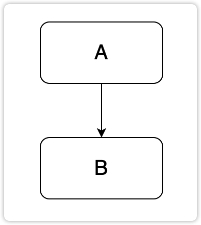
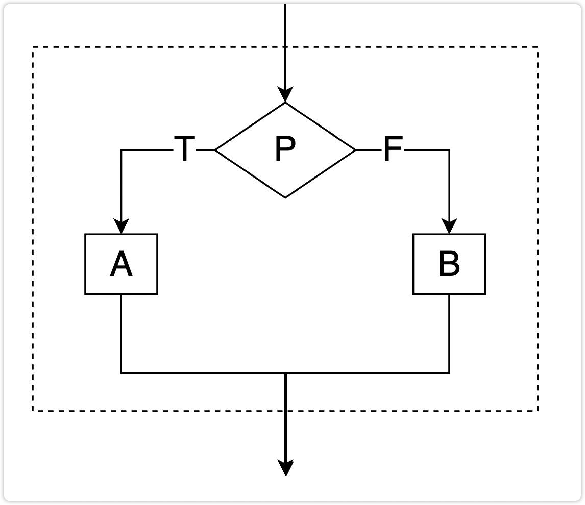
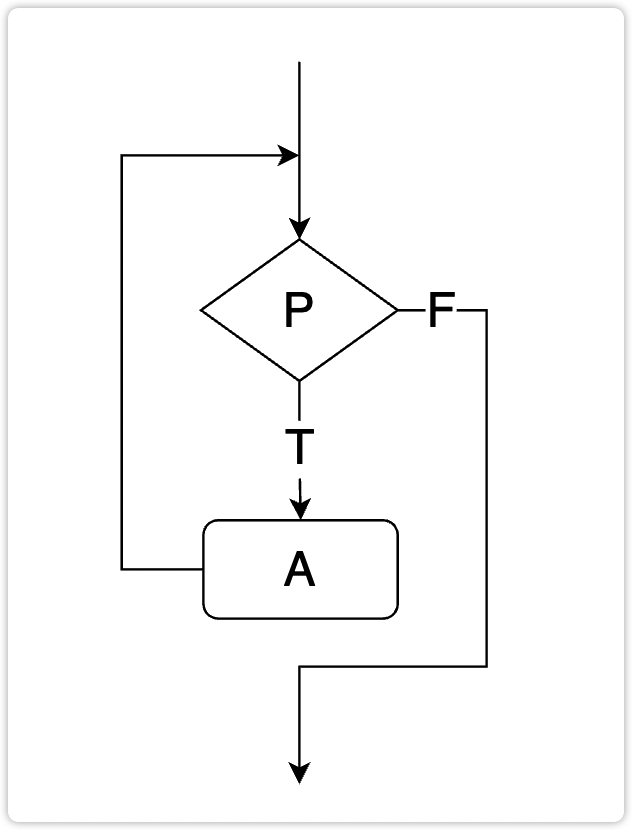
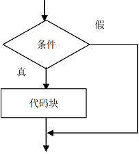
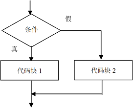
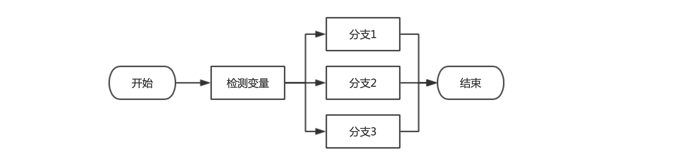
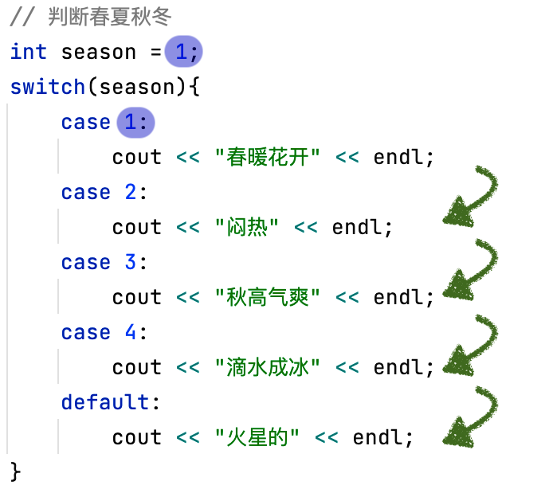

# 一、流程控制概述

## 1、程序的执行结构

我们之前在写代码，执行代码的时候，发现写的代码都是一行一行的执行的。这种执行的结构称为 “顺序结构”，除了这种结构之外，还有其他的执行结构。

1、顺序结构：代码从上往下，依次执行。



2、分支结构：程序在某一个节点遇到了多种向下执行的可能性，根据条件，选择一个分支继续执行。



3、循环结构：某一段代码需要被重复执行多次。



## 2、流程控制的概念

流程控制，就是通过指定的语句，修改程序的执行结构。 按照修改的不同的执行结构，流程控制语句可以分为：

-   **分支流程控制语句**
    -   顾名思义，就是将程序的执行结构修改为分支结构。
    -   常见的分支流程控制语句有：`if-else`、`switch-case`
-   **循环流程控制语句**
    -   顾名思义，就是将程序的执行结构修改为循环结构。
    -   常见的循环流程控制语句有：`for`、`while`、`do-while`

# 二、分支结构

## 1、if 语句

### 1.1、if 的基础语法

if 的结构图：

```flow
st=>start: 开始
e=>end: 结束
con=>condition: 判断条件
op1=>operation: 分支判断逻辑
s1=>operation: 分支语句1
s2=>operation: 分支语句2

st(right)->op1(right)->con(yes,right)->s1->e
con(no)->s2->e
```

if 的基础语法格式：

```c++
if (/* 条件判断 true or false */) {
    // 条件结果为true执行大括号以内的语句
}
/*
	执行流程：
	代码运行到if分支结构，首先判断if之后的条件是否为true，
	如果为true，执行大括号里面的语句，如果为false直接执行大括号之外的语句
*/
```



```c++
#include <iostream>

using namespace std;

int main() {
    if (true) {
        cout << "true" << endl;
    } else {
        cout << "false" << endl;
    }

    // 示例1：在控制台上输入一个成绩，如果这个成绩及格了，输出“及格”
    int score = 0;
    cout << "请输入分数：" << endl;
    cin >> score;
    if (score >= 60) {
        cout << "及格" << endl;
    }

    return 0;
}
```

```c++
#include <iostream>

using namespace std;

int main() {
    /*
        案例2：
        如果C++成绩大于98分，并且mysql的成绩大于80分，老师奖励一颗糖。
        或者c++的成绩等于100分，并且mysql的成绩大于70分的，老师也奖励一颗糖。
    */
    int scoreOfCpp = 0, scoreOfMysql = 0;
    cout << "请输入C++成绩：" << endl;
    cin >> scoreOfCpp;
    cout << "请输入Mysql成绩：" << endl;
    cin >> scoreOfMysql;
    if ((scoreOfCpp > 98 && scoreOfMysql > 80) || (scoreOfCpp == 100 && scoreOfMysql > 70)) {
        cout << "奖励一颗糖" << endl;
    }

    return 0;
}
```

### 1.2、if-else 的使用

语法：

```c++
if (condition) {
    // 代码段1
}
else {
    // 代码段2
}
```

逻辑：condition 是一个 boolean 类型的变量，或者一个 boolean 结果的表达式。如果 condition 的值为 true，则代码段 1 执行，否则，代码段 2 执行



* 示例 1：输入一个成绩，如果及格了，输出“及格”；如果不及格，输出“不及格”

```c++
#include <iostream>

using namespace std;

int main() {
    int score;
    cout << "请输入一个成绩：";
    cin >> score;
    if (score >= 60) {
        cout << "及格" << endl;
    } else {
        cout << "不及格" << endl;
    }
    
    return 0;
}
```

-   示例 2：输入一个性别，如果是男，输出 “永远 18 岁”；如果不是男，输出 “永远 16 岁”

```c++
#include <iostream>

using namespace std;

int main() {
    string sex;
    cout << "请输入你的性别：";
    cin >> sex;
    if (sex == "男") {
        cout << "永远18岁" << endl;
    } else {
        cout << "永远16岁" << endl;
    }

    return 0;
}
```

-   示例 3：买彩票，如果中奖了，买房、买车、非洲旅游！否则就继续搬砖

```c++
#include <iostream>

using namespace std;

int main() {
    bool isWin = false;
    cout << "请输入是否中奖：";
    cin >> isWin;
    if (isWin) {
        cout << "买房、买车、非洲旅游！" << endl;
    } else {
        cout << "继续搬砖" << endl;
    }

    return 0;
}
```

* 案例 4：输入一个字符，如果是字母，输出 “是字母”，否则就输出 “不是字母”

```c++
#include <iostream>

using namespace std;

int main() {
    char ch;
    cout << "请输入一个字符：";
    cin >> ch;
    if (ch >= 'a' && ch <= 'z' || ch >= 'A' && ch <= 'Z') {
        cout << "是字母" << endl;
    } else {
        cout << "不是字母" << endl;
    }
    
    return 0;
}
```

### 1.3、else if 的使用

语法：

```c++
if (condition1) {
    // 代码段1
}
else if (condition2) {
    // 代码段2
}
else {
    // 代码段3
}
```

逻辑：先判断 condition1，如果 condition1 成立，执行代码段 1；如果 condition1 不成立，再判断 condition2，如果 condition2 成立，执行代码段 2，否则执行代码段 3

-   示例 1：输入一个成绩，输出成绩的等级。< 0 或者 > 100 输出 “错误成绩”，[0, 60) 输出 “不及格”，[60, 80)：输出 “中”，[80, 90)：输出 “良”，[90, 100] 输出 “优”

```c++
#include <iostream>

using namespace std;

int main() {
    int score;
    cout << "请输入你的成绩:";
    cin >> score;
    
    if (score < 0 || score > 100) {
        cout << "错误成绩" << endl;
    } else if (score >= 0 && score < 60) {
        cout << "不及格" << endl;
    } else if (score >= 60 && score < 80) {
        cout << "中"<< endl;
    } else if (score >= 80 && score < 90) {
        cout << "良" << endl;
    } else {
        cout << "优" << endl;
    }
    
    return 0;
}
```

-   输入一个字符，如果是小写字母，将其转成大写输出；如果是大写字母，将其转成小写输出；如果不是字母，原义输出。

```c++
#include <iostream>

using namespace std;

int main() {
    char ch;
    cout << "请输入一个字符：" << endl;
    cin >> ch;
    
    if (ch >= 'a' && ch <= 'z') {
        cout << (char)(ch - 32) << endl;
    } else if (ch >= 'A' && ch <= 'Z') {
        cout << (char)(ch + 32) << endl;
    } else {
        cout << ch << endl;
    }

    return 0;
}
```

> 注意事项：
>
> 无论是 if 还是 else，后面的大括号中如果有且只有一条语句的情况下，此时的大括号是可以省略不写的
>
> 但实际情况下，我们在进行程序开发的时候，这里的大括号一般不省略！！！
>
> 因为如果省略了大括号，会对程序的可读性造成一定影响，也容易出现 BUG

```c++
#include <iostream>

using namespace std;

int main() {
    char ch;
    cout << "请输入一个字符：" << endl;
    cin >> ch;
    
    if (ch >= 'a' && ch <= 'z' || ch >= 'A' && ch <= 'Z')
        cout << "是字母" << endl;
    else
        cout << "不是字母" << endl;
    
    return 0;
}
```

## 2、switch 语句

### 2.1、switch 基础语法

switch 结构图：



switch 基础语法格式：

```c++
switch (variable) { 
    case const1:
        statement1;
        break;
    case const2:
        statement2;
        break;
        … …
    case constN:
        statementN;
        break;
    default:
        statement_dafault;
        break;
}
```

**程序逻辑**：

- 检测某一个变量的值， 从上往下依次与每一个 case 进行校验、匹配
- 如果变量的值和某一个 case 后面的值相同，则执行这个 case 后的语句
- 如果变量的值和每一个 case 都不相同，则执行 default 后的语句

switch 的语法规则：

1. 表达式 expr 的值必须是整型

2. case 子句中的值 const 必须是常量值，case 中的值不能是一个范围

3. 所有 case 子句中的值应是不同的，否则会编译出错

4. default 子句是可选的，不是必须的

5. break 语句用来在执行完一个 case 分支后使程序跳出 switch 语句块；否则会继续执行下去

```c++
#include <iostream>

using namespace std;

int main() {
    int season = 0;
    cout << "请输入一个季节（1-4）：";
    cin >> season;

    // 判断春夏秋冬
    switch (season) {
        case 1:
            cout << "春暖花开" << endl;
            break;
        case 2:
            cout << "闷热" << endl;
            break;
        case 3:
            cout << "秋高气爽" << endl;
            break;
        case 4:
            cout << "滴水成冰" << endl;
            break;
        default:
            cout << "错误的季节" << endl;
            break;
    }
    
    return 0;
}
```

### 2.2、switch 的穿透性

我们来看一段代码

```c++
// 判断春夏秋冬
int season = 1;
switch (season) {
    case 1:
        cout << "春暖花开" << endl;
    case 2:
        cout << "闷热" << endl;
    case 3:
        cout << "秋高气爽" << endl;
    case 4:
        cout << "滴水成冰" << endl;
    default:
        cout << "火星的" << endl;
}
```

上述代码中， switch 结构捕获变量 season 的值。变量的值和第一个 case 是匹配的，应该输出的结果是 "春暖花开"。但实际上的输出结果却是从 "春暖花开" 开始的每一个输出。

因为在 switch 结构中有 “穿透性”。

**switch 的穿透性指的是， 当 switch 的变量和某一个 case 值匹配上之后，将会跳过后续的 case 或者 default 的匹配，直接向后穿透**。



为了杜绝穿透， 可以使用关键字 `break`：


### 2.3、合理的使用穿透性

需求：输入一个年、月、日，输出这一天是这一年的第几天

例如：输入 2022 7 7，输出 2022年7月7日是2022年的第xxx天

```c++
#include <iostream>

using namespace std;

int main() {
    int year, month, day;
    cout << "请输入年、月、日：";
    cin >> year >> month >> day;

    // 定义变量，记录总天数
    int days = day;

    switch (month) {
        case 12: days += 30;
        case 11: days += 31;
        case 10: days += 30;
        case 9: days += 31;
        case 8: days += 31;
        case 7: days += 30;
        case 6: days += 31;
        case 5: days += 30;
        case 4: days += 31;
        case 3: days += year % 4 == 0 && year % 100 != 0 || year % 400 == 0 ? 29 : 28;
        case 2: days += 31;
    }

    cout << year << "年" << month << "月" << day << "日是" << year << "年的第" << days << "天" << endl;

    return 0;
}
```

# 三、循环结构

## 1、while 循环

### 1.1、while 循环的基础语法

当某一段代码需要被多次执行，并且每次执行的时候，是遵循一定的规律的，这种情况下会考虑使用循环

while 语句由关键字 while 小括号 大括号 以及相关语句组成，基本格式如下：

```c++
while (条件表达式) {
	循环体
}
```

**条件表达式**：循环终止的判断条件语句，要求为布尔表达式，也就是结果为真或假值，比如 i < 10;

**循环体**：n 行循环要执行的语句

while 的结构：

```flow
s=>start: 开始
e=>end: 结束
con=>condition: 判断条件
loop=>operation: 循环体
loopstep=>operation: 循环步长

s(right)->con(yes, right)->loop(right)
con(no)->e
loop(top)->con
```

**流程说明**：

1.   执行条件表达式，也就是执行循环终止的判断条件语句，看其结果是 true 还是 false，如果是 false，循环结束，如果是 true 继续执行
2.   执行循环体语句，也就是执行大括号中的实际代码
3.   回到第一步再次执行，第一到第三步，直到某次第一步表达式结果为 false

> while 循环的注意事项：
>
> * while 循环本身没有循环变量声明和初始化的组成部份，所以如果有这个需要，应在 while 循环前声明循环变量并赋值
>
> * while 循环本身也没有控制循环终止的判断条件语句部分，所以需要在循环体中增加相应的控制语句，否则容易死循环

### 1.2、while 循环案例

1.   打印输出 5 次 “我爱编程，我爱C++”

     ```c++
     // 初始化部分
     int count = 0;
     // 循环条件 
     while (count < 5) {
         // 循环体
         cout << "我爱编程，我爱C++" << endl;
         // 更新循环变量
         count++;
     }
     ```

2.   求 10 的阶乘

     ```c++
     long long sum = 1;
     int i = 1;
     while (i++ <= 10) {
         sum *= i;
     }
     cout << "10的阶乘是: " << sum << endl;
     ```
     
3.   求 1 ~ 100 的和

     ```c++
     int i = 1;		// 初始化变量
     int sum = 0;	//保存和
     // 循环条件
     while (i <= 100) {
         sum += i;
         i++;
     }
     cout << "1-100的和是: " << sum << endl;
     ```

4.   求 100 以内的偶数的和

     ```c++
     // 写法一
     int z = 2;
     int sum = 0;
     while (z <= 100) {
         sum = sum + z;
         z += 2;
     }
     cout << "1-100的偶数的和是: " << sum << endl;
     
     // 写法二
     int z = 1;
     int sum = 0;
     while (z <= 100) {
         if(z % 2 == 0){
             sum += z;
         }
         z++;
     }
     cout << "1-100的偶数的和是: " << sum << endl;
     ```

5. 在控制台上输入一个整型的数字，如果用户在控制台上输入的不正确，让用户重复输入，直到输入正确为止

   ```c++
   #include <iostream>
   #include <limits>
   
   using namespace std;
   
   int main() {
       int number = 0;
       cout << "请输入一个整数：";
       cin >> number;
       while (cin.fail()) {
           cout << "输入错误，请重新输入：";
           cin.clear();
           cin.ignore(numeric_limits<streamsize>::max(), '\n');
           cin >> number;
       }
       cout << "number = " << number << endl;
       
       return 0;
   }
   ```

## 2、do-while 循环

### 2.1、do-while 循环的基本语法

do-while 语句由 do 关键字、大括号、while 关键字、小括号和相关语句组成，基本格式如下：

```c++
do {
    循环体
} while (条件表达式);
```

do-while 循环的执行结构：

1.   执行循环体语句，也就是执行大括号中的实际代码
2.   执行条件表达式，也就是执行循环终止的判断条件语句，看其结果是 true 还是 false，如果是 false，循环结束，如果是 true 继续执行
3.   回到第一步再次执行第一到第三步，直到某次第一步表达式结果为 false

do-while 循环的特点和注意事项：

1. do-while 循环为先执行后判断，也就是先执行一次循环体中的代码，然后再检查条件表达式，所以do-while循环至少会执行一次

2. 其它特点和 while 循环一样

```c++
do {
    cout << "Hello World!" << endl;
} while (false);
```

### 2.2、do-while 循环练习 

1.   打印三次 helloworld

     ```c++
     // 1.初始化部分
     int i = 0;
     do {
         // 2.循环体
         cout << "Hello World!" << endl;
         // 4.循环变量变化部分
         i++;
     } while (i < 3); // 3.循环条件
     ```

2.   用 do-while 实现打印 100 以内的奇数

     ```c++
     int j = 1;
     do {
         cout << j << endl;
         j += 2;
     } while (j < 100);
     ```

3.   打印输出 100 以内能够被 3 整除，但是不能被 5 整除的数

     ```c++
     int z = 3;
     do {
         if(z % 3 == 0 && z % 5 != 0){
             cout << z << endl;
         }
         z++;
     } while (z <= 100);
     ```

## 3、for 循环

### 3.1、for 循环的基础语法

for 语句由关键字 for、小括号、大括号以及相关语句组成，基本格式如下：

```c++
for(循环起点; 循环条件; 循环步长) {
    循环体
}
```

**循环起点**：循环变量初始化语句，比如 `int i = 0;`

**循环条件**：循环终止的判断条件语句，要求为布尔表达式，也就是结果为真或假值，比如 `i < 10;`

**循环步长**：循环改变的控制条件语句，比如 `i++`

**循环体**：循环要执行的语句

三个表达式之间用分号分隔

for 循环的结构图：

```flow
s=>start: 开始
e=>end: 结束
loops=>operation: 循环起点
con=>condition: 判断条件
loop=>operation: 循环体
loopstep=>operation: 循环步长

s(right)->loops(right)->con(yes, right)->loop(right)->loopstep
con(no)->e
loopstep(top)->con
```

**流程说明**：

1.   执行循环起点，也就是执行循环变量初始化语句

2.   执行判断条件，也就是执行循环终止的判断条件语句，看其结果是 true 还是 false

     * 如果是 false，循环结束。
     * 如果是 true，继续执行第三步。
     
3.   第三步：执行循环体语句，也就是执行大括号中的实际代码

4.   第四步：执行表达式 3，也就是执行循环改变的控制条件语句，使循环变量的值发生改变

5.   第五步：回到第二步再次执行第二到第五步，直到第二步的表达式结果为 false，循环结束

```c++
for (int i = 0; i < 10; i++) {
    cout << "当前循环变量的值是" << i << endl;
}
/*
第一步：执行 int i = 0;
第二步：执行 i < 10;（此时i值为0）结果为true,所以程序继续执行第三步
第三步：执行 cout << "当前循环变量的值是" << i << endl; 打印输出
第四步：执行 i++（执行后i值为1）
第五步：执行（回到第二步执行）i < 10;（此时i值为1）表达式结果依然为true,
       所以程序继续（执行三到五步，直到某次第二步的语句结果为false ,程序结束）
*/
```

### 3.2、for 循环基础案例

1.   打印输出 3 次 helloworld

     ```c++
     for (int i = 0; i < 3; i++) {
         cout << "Hello World!" << endl;
     }
     ```

2.   打印 100 以内，能被 4 整除但不能被 7 整除的数，每行打印 6 个

     ```c++
     int count = 0;
     for (int i = 1; i <= 100; i++) {
         if(i % 4 == 0 && i % 7 != 0){
     		cout << i << "\t";
             if(++count % 6 == 0) {
     			cout << endl;
             }
         }
     }
     ```
     
3.   打印 1 到 100 的所有整数

     ```c++
     // 注意：正常循环变量初值一般为0，这里从1开始，结束条件是否包括等于，需要根据实际需求决定
     for (int i = 1; i <= 100; i++) {
         cout << "整数值:" << i << endl;
     }
     ```

4.   计算 1 + 2 + 3 + ... + 100 的和

     ```c++
     int sum = 0;
     for (int i = 1; i <= 100; i++) {
         sum += i;
     }
     cout << "1到100的所有整数和为:" << sum << endl;
     ```
     
5.   统计 1 到 100 之间分别能被 3 整除或 5 整除或同时被 3 和 5 整除的数字个数并打印

     ```c++
     #include <iostream>
     #include <sstream>
     
     using namespace std;
     
     int main() {
         // 记录能被3整除的数字个数、能被5整除的数字个数、能被3和5整除的数字个数
         int count3 = 0, count5 = 0, count35 = 0;
         // 使用字符串流记录能被3整除的数字、能被5整除的数字、能被3和5整除的数字
         ostringstream oss3, oss5, oss35;
     
         // 循环遍历数字
         for (int n = 1; n <= 100; n++) {
             if (n % 3 == 0 && n % 5 == 0) {
                 count35++;
                 oss35 << n << ", ";
             } else if (n % 3 == 0) {
                 count3++;
                 oss3 << n << ", ";
             } else if (n % 5 == 0) {
                 count5++;
                 oss5 << n << ", ";
             }
         }
     
         cout << "能被3整除，不能被5整除的数字有" << count3 << "个" << endl;
         cout << "分别是: " << oss3.str() << endl;
     
         cout << "能被5整除，不能被3整除的数字有" << count5 << "个" << endl;
         cout << "分别是: " << oss5.str() << endl;
     
         cout << "能同时被3和5整除的数字有" << count35 << "个" << endl;
         cout << "分别是: " << oss35.str() << endl;
     
         return 0;
     }
     ```
     
6.   打印九九乘法表

     ```c++
     // 九九乘法表共有45个结果，所以需要循环45次 第一行输出一个结果，第二行输出二个结果，...第九行输出九个结果
     // 用来记录当前行号
     int row = 1;
     // 用来记录当前列号（也就是当前行的第几个结果）
     int col = 1;
     for (int i = 0; i < 45; i++) {
         // 输出row行的第col个结果,不换行
         cout << col << " x " << row << " = " << (col * row);
         // 同一行中多个结果之间的分隔符
     	cout << "\t";
         // 如果行号和列号相等，说明第row行已打印完成
         if (row == col) {
             // 打印换行符
             cout << endl;
             // 列号重置
             col = 1;
             // 行号加1
             row++;
         } else {
             // 列号加1
             col++;
         }
     }
     ```
     
7.   判断指定的数字是否是质数并输出

     ```c++
     // 用来记录是否是质数的布尔变量，false就是质数
     bool flag = false;
     // 需要判断的数字，实际可由用户通过键盘输入
     int checkNumber = 100;
     // 循环判断当前数字是否能被1和它本身外的数字整除
     for (int i = 2; i < checkNumber; i++) {
         // 如果能被整除，说明不是质数
         if (checkNumber % i == 0) {
             // 设置标质不是质数
             flag = true;
         }
     }
     //根据标记变量的真假，直接输出结果
     cout << "整数" << checkNumber << (flag?"不是质数":"是质数") << endl;
     ```

### 3.3、for 循环的特殊用法

for 循环的小括号中的每一个部分都可以省略不写

* 省略初始化部分：可以把循环控制变量，定义在循环的外边
* 省略条件判断部分：默认条件是永远成立的
* 省略迭代部分：可以把对循环控制变量的修改放在循环体里面

注意事项：虽然每一部分都可以省略不写，但是分号是不能省略的。

```c++
// 第一种，将表达式一省略，放到循环前面
int i = 0;
for (; i < 10; i++) {
    cout << "当前循环变量的值是" << i << endl;
}

// 第二种，将表达式3省略，放到循环体中
int i = 0;
for (; i < 10; ) {
    cout << "当前循环变量的值是" << i << endl;
    i++;
}

//第三种，将表达式1，2，3全部省略 此种为死循环，一般需要在循环体中给出结束条件
for ( ; ; ) {
    cout << "当前循环变量的值是" << i << endl;
}
```

## 4、流程控制关键字

### 4.1、break 关键字

作用：break 语句用于终止某个语句块的执行

用法：如果是在循环中，作用为跳出所在的循环；如果是在 switch 语句中，则为跳出所在的 switch 语句

```c++
for (int i = 0; i < 10; i++) {
    cout << i << endl;
    if (i == 5) {
        break;
    }
}

for (int i = 0; i < 5; i++) {
    for (int j = 0; j < 3; j++) {
        cout << "i = " << i << ", j = " << j << endl;
        if (i == 2) {
            break; // 跳出内层循环，进行下一次外层循环
        }
    }
}
```

### 4.2、continue 关键字

作用：跳过本次循环，执行下一次循环（如果有多重循环，默认继续执行离自己最近的循环）提前终止本次循环

使用：只能在循环结构中使用

```c++
for (int i = 0; i < 10; i++) {
    // 当 i==5 时，跳过本次循环，不进行打印输出
    if (i == 5) {
        continue;
        // 从这里开始，循环体中之后的代码不再执行，立即执行迭代部分的代码，继续判断循环条件是否成立
    }
    cout << i << endl;
}
```

### 4.3、goto 关键字

在程序中，可以任意的设置 “标签”，使用关键字 `goto` 可以直接跳转到指定的标签位置继续执行程序

```c++
label1:
    cout << 1 << endl;
    goto label3;

label2:
    cout << 2 << endl;
    goto label5;

label3:
	cout << 3 << endl;

label4:
	cout << 4 << endl;
	goto label2;

label5:
	cout << "end" << endl;
```

```c++
for (int i = 0; i < 10; i++) {
    for (int j = 0; j < i; j++) {
        cout << "i = " << i << ", j = " << j << endl;
        if (i == 4 && j == 3) {
            goto label1;
        }
    }
}

label:
cout << "end" << endl;
```

## 5、多重循环

1. 概念：多重循环就是指在循环内嵌套其它循环，和选择语句嵌套类似，嵌套几层就是几重循环，最常见的为双重循环和三重循环
2. 说明：外层循环执行一次，它的内层循环执行一轮（也就是内循环正常循环一遍结束）

```
第一步: 从外层循环开始执行，先执行一次进入循环体（里面包括内层循环）
第二步: 遇到内层循环，开始正常执行，直到内循环循环结束
第三步: 继续外循环的下一次循环（回到第一步）
```

案例：

1. 用双重循环实现九九乘法表的打印

   ```c++
   for (int i = 1; i <= 9; i++) {
       for (int j = 1; j <= i; j++) {
           cout << j << " * " << i << "=" << (i * j) << "\t";
       }
   	cout << endl;
   }
   ```

2. 打印直角三角形

   ```c++
   for (int i = 1; i <= 5; i++) {
       for (int j = 1; j <= i; j++) {
           cout << "*" << endl;
       }
   	cout << endl;
   }
   ```

3. 打印等腰三角形

   ```c++
   for (int i = 1; i <= 5; i++) {
       for (int k = 1; k <= 5 - i; k++) {
           cout << " ";
       }
       for (int j = 1; j <= i * 2 - 1; j++) {
   		cout << "*";
       }
   	cout << endl;
   }
   ```

4. 求 1000 以内的完数

   ```c++
   //完数定义：若一个自然数，恰好与除去它本身以外的一切因数的和相等，这种数叫做完全数。例如，6=1+2+3
   for (int i = 2; i < 1000; i++) {
       int sum = 0;
       for (int j = 1; j < i; j++) {
           if (i % j == 0) {
               sum += j;
           }
       }
       if (sum == i) {
           cout << "1000之内的完整数：" << i << endl;
       }
   }
   ```

5. 百钱买百鸡：已知一只母鸡 5 块钱，一只公鸡 3 块钱，3 只小鸡 1 块钱，现在你有 100 块钱，要求买 100 只鸡，正好花完这 100 块钱，不能剩余，也不能欠账，输出所有购买方案

   ```c++
   // 遍历所有的可购买的母鸡的个数
   for (int x = 0; x <= 20; x++) {
       // 遍历所有的可购买的公鸡的个数
       for (int y = 0; y <= 33; y++) {
           // 计算小鸡的数量
           int z = 100 - x - y;
           if (z % 3 == 0 && (x * 5 + y * 3 + z / 3 == 100)) {
               cout << "公鸡：" << x << "只，母鸡：" << y << "只，小鸡：" << z << "只" << endl;
           }
       }
   }
   ```